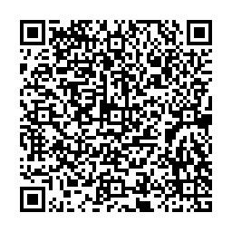

# go-qrcode-vcard-example #

## Download go-qrcode library so we can use in our code

    go get -u github.com/skip2/go-qrcode/...

## In our code, we imported the go-qrcode library

    import qrcode "github.com/skip2/go-qrcode"

- **Example code to read vcard data from a file and produce a qrcode image**

       func main() {

          file, err := os.Open("vcard.txt")
          if err != nil {
            log.Fatal(err)
          }
          defer file.Close()

          b, err := ioutil.ReadAll(file)
          if err != nil {
            log.Fatal(err)
          }

          str := string(b)
          qrFname := "vcard-qr.png"

          err = qrcode.WriteFile(str, qrcode.Medium, 256, qrFname)
          if err != nil {
            log.Fatal(err)
          }

      }

## Here is sample data which you can use for vcard.txt

    BEGIN:VCARD
    VERSION:3.0
    N:name
    ORG:company
    TITLE:title
    TEL:123
    URL:https://www.website.com
    EMAIL:test@email.com
    ADR:address1 address2
    NOTE:memo
    END:VCARD

## References

- [go-qrcode](https://github.com/skip2/go-qrcode)
- You can generate vcard data using the [Zxing generator](http://zxing.appspot.com/generator/)